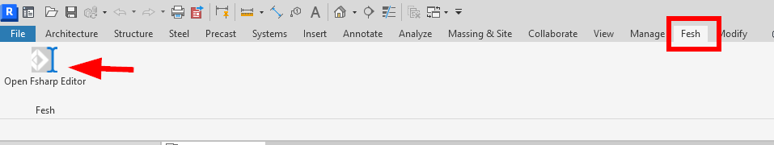

# Fesh.Revit

Fesh.Revit is an F# scripting editor hosted inside [Revit]("https://www.autodesk.com/products/revit/overview"). It is based on [Fesh](https://github.com/goswinr/Fesh).\
It has semantic syntax highlighting, auto completion, type info tooltips and more.\
The output window supports colored text.

The example script in the root folder generates the axes for cladding of the Louvre Abu Dhabi.\
See also my talk at <a href="https://www.youtube.com/watch?v=ZY-bvZZZZnE" target="_blank">FSharpConf 2016</a>

### How to build
Before compiling make sure the path in the file `AddIn\20XX\Fesh.addin` matches your local path.\

Then just run  `dotnet build`.\
The `addin` file will then be copied to `C:/ProgramData/Autodesk/Revit/Addins/20XX/Fesh.addin` as the last step of the build process.\
See end of the `.fsproj` file.\
Now just start Revit and the Fesh addin should be available in the tabs:\

### How to use F# with Revit
By default a f# script evaluation starts asynchronous on a new thread. The `Fesh.Revit.dll` also provides utility functions to run <a href="https://knowledge.autodesk.com/support/revit-products/learn-explore/caas/CloudHelp/cloudhelp/2014/ENU/Revit/files/GUID-C946A4BA-2E70-4467-91A0-1B6BA69DBFBE-htm.html" target="_blank">synchronous transaction</a> on the current document or app instance:

    Fesh.Revit.ScriptingSyntax.runApp (fun (app:UIApplication)  -> ...)

### License
[MIT](https://github.com/goswinr/Fesh.Revit/blob/main/LICENSE.md)

