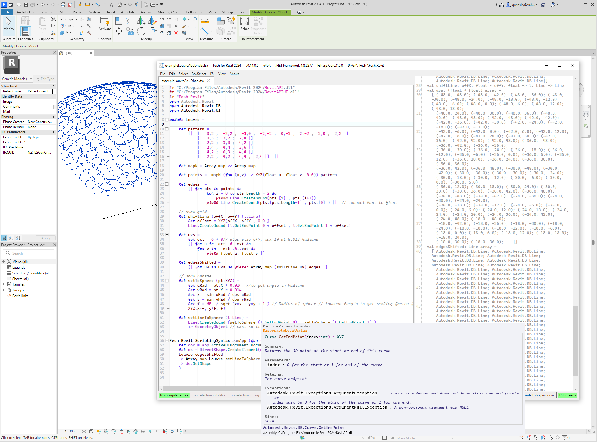

# Fesh.Revit
[](https://github.com/goswinr/Fesh.Revit/actions/workflows/build.yml)
<!-- [](https://github.com/goswinr/Fesh.Revit/actions/workflows/outdatedNuget.yml) -->


[](LICENSE.md)

Fesh.Revit is an F# scripting editor hosted inside [Revit](https://en.wikipedia.org/wiki/Autodesk_Revit). It is based on [Fesh](https://github.com/goswinr/Fesh).<br>
It has semantic syntax highlighting, auto completion, type info tooltips and more.<br>
The output window supports colored text.


The example script in the root folder generates the axes for cladding of the Louvre Abu Dhabi.<br>
See also my talk at <a href="https://www.youtube.com/watch?v=ZY-bvZZZZnE" target="_blank">FSharpConf 2016</a>


## How to install

Download and run the Setup.exe from [Releases](https://github.com/goswinr/Fesh.Revit/releases).<br>
The current version is built for .NET 10, for Revit 2026 (updated to its .NET 10 version) and later.<br>
For Revit 2025 use [Fesh.Revit 0.32.3 for .NET 8](https://github.com/goswinr/Fesh.Revit/releases/tag/0.32.3).<br>
For Revit 2024 or earlier use [Fesh.Revit 0.32.3 for .NET 4.8](https://github.com/goswinr/Fesh.Revit/releases/tag/0.32.3-net48).<br>
They can be installed side by side.

Fesh.Revit will automatically offer to update itself when a new version is available.

The installer is created with [Velopack](https://velopack.io) and digitally signed.

No admin rights are required to install or run the app.<br>
The app will be installed in `\AppData\Local\Fesh.Revit.net10`. <br>
Setup will launch the `Fesh.Revit.Bootstrapper.exe`. It will register the `Fesh.Revit.dll` with Revit <br>
by creating a `Fesh.addin` xml file in the Revit Addins folder at `C:/ProgramData/Autodesk/Revit/Addins/20XX/Fesh.addin`.


### How to use F# with Revit
By default a f# script evaluation starts asynchronous on a new thread. <br>
The `Fesh.Revit.dll` also provides utility functions to run synchronous transactions on the current document or app instance.
You need to use this when changing the document or when you need to access the app instance. <br>

```fsharp
Fesh.Revit.Scripting.transactWithApp (fun (app:UIApplication)  -> ... )
```

## Release Notes
For changes in each release see the  [CHANGELOG.md](https://github.com/goswinr/Fesh.Revit/blob/main/CHANGELOG.md)

## Publisher Privacy Policy
Fesh.Revit does not collect any data.<br>
The app only connects to the internet to check for updates on the [Github Releases](https://github.com/goswinr/Fesh.Revit/releases) page and downloads upon user confirmation.<br>
The relevant source code is here: [Velo.fs](https://github.com/goswinr/Fesh.Revit/blob/main/Fesh.Revit/Src/Velo.fs).

## License
Fesh is licensed under the [MIT License](https://github.com/goswinr/Fesh.Revit/blob/main/LICENSE.md).
